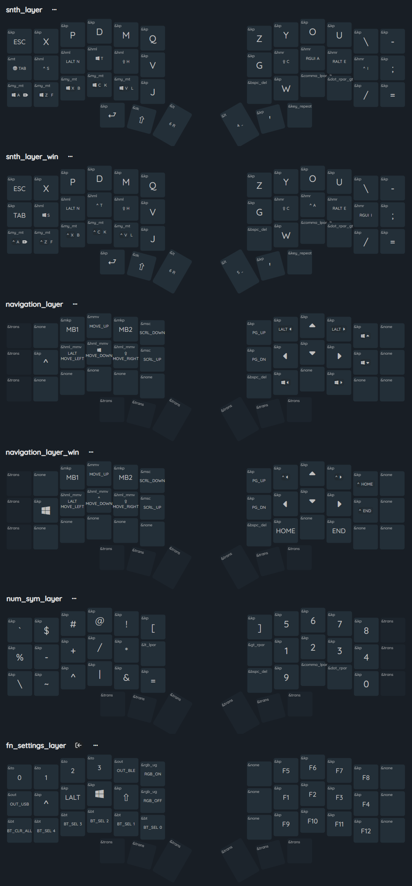

# Corne Wireless ZMK Configuration

This repository contains custom [ZMK Firmware](https://zmk.dev/) configuration for split Corne (CRKBD) keyboards.

## ⌨️ Hardware

- **Keyboard:** Corne (Left & Right halves)
- **Microcontroller:** nice!nano v2 (Bluetooth and USB)
- **Display:** OLED enabled in the firmware

## ✨ Keymap Features

This keymap is customized for advanced workflows, featuring multi-OS support, mouse emulation, and complex hold-tap behaviors.

### Multi-OS Support

The keymap provides a dedicated base ([SNTH layout](https://www.reddit.com/r/KeyboardLayouts/comments/18jefux/snth/)), alternative ([Focal layout](https://github.com/Keyhabit/Focal-keyboard-layout/)), and navigation layers for both **MacOS** and **Windows**, ensuring modifier keys and OS-specific shortcuts (like Spotlight vs. Start Menu, Mission Control, etc.) work perfectly regardless of the device you are connected to.

### Advanced Behaviors

- **Home Row Mods:** Modifiers (Ctrl, Alt, Gui, Shift) are embedded into the home row keys using custom `hold-tap` behaviors (`hml` & `hmr`) to reduce hand movement and free up a thumb key (left).
- **Common Shortcuts:** Dedicated hold-tap keys are configured for frequently used shortcuts (e.g., Undo, Cut, Copy, Paste, such as `Ctrl-C` / `Cmd-C`).
- **Mod-Morphs:** Specialized keys that change behavior when Shift or GUI is held. For example:
  - `,` morphs to `(` on shift (replacing `<`)
  - `.` morphs to `)` on shift (replacing `>`)
  - `Backspace` morphs to `Delete` on shift
  - `<` morphs to `(` on the symbol layer
  - `>` morphs to `)` on the symbol layer
- **Sticky Shift:** A dedicated thumb key utilizes ZMK's sticky key behavior (`&sk`) for Shift, letting you quickly tap to capitalize the next letter without having to hold the key down.
- **Mouse Emulation:** Full mouse pointer control and scrolling via ZMK's pointing behaviors (`&mmv` and `&msc`) integrated into the Navigation layers.

### Layers

| Layer | Name | Description |
| :--- | :--- | :--- |
| `0` | **SNTH (Mac)** | Primary base layer optimized for macOS. |
| `1` | **SNTH (Win)** | Primary base layer optimized for Windows. |
| `2` | **Focal (Mac)** | Alternative base layer for macOS. |
| `3` | **Focal (Win)** | Alternative base layer for Windows. |
| `4` | **NAV (Mac)** | Navigation arrows, mouse movement, clicking, scrolling, and macOS specific nav. |
| `5` | **NAV (Win)** | Navigation arrows, mouse movement, clicking, scrolling, and Windows specific nav. |
| `6` | **NUM & SYM** | Numpad and symbols. |
| `7` | **F-keys & Settings** | Bluetooth profile selection/clearing, F-keys, RGB toggles, and Output selection (USB/BLE). *Accessed by pressing NAV + SYM layer keys simultaneously.* |

### Combos

Several powerful combos are mapped to key chords:

- **Media Controls:** Play/Pause, Mute, Volume Up/Down
- **System Shortcuts:** Spotlight/Start Menu, Screenshot/Snipping Tool, Mission Control
- **Hardware Commands:** Enter Bootloader, System Reset

The **Bootloader** combo can be activated by briefly pressing the three left-most keys (DEL F B) on the bottom row of the left-hand half simultaneously, while the keyboard is disconnected.

## 🗺️ Keymap Layout

*(Note: The Focal layout is not shown in this image.)*

## 🛠️ How to Customize and ⚡ Flash

### 1. Fork this Repository

To make your own changes, click the **Fork** button at the top right of this repository's GitHub page. This creates a personal copy of the repository under your own GitHub account.

### 2. Edit the Keymap

The easiest way to customize your layout is using the visual **ZMK Keymap Editor**:
<https://nickcoutsos.github.io/keymap-editor/>

1. Go to the website and grant it access to your GitHub account.
2. Select your newly forked repository.
3. Make your desired keymap changes using the visual interface.
4. Click **Save**. This will automatically commit and push the changes directly to your GitHub fork.

### 3. Download the Firmware

When you save changes in the Keymap Editor (or push a commit manually), GitHub Actions will automatically start building the new firmware based on your `build.yaml` file.

1. Go to the **Actions** tab of your forked repository on GitHub.
2. Click on the top (most recent) workflow run.
3. Scroll down to the **Artifacts** section and download the generated zip file.
4. Extract the `.zip` file on your computer to access the compiled `.uf2` files.

### 4. Flash the Keyboard

1. Connect one half of your keyboard to your computer via USB.
2. Put the **nice!nano** into bootloader mode:
   - Double-tap the hardware reset button. This button can be found under the screen protector.
   - Alternatively, if it's already running this firmware, use the bootloader combo on the left half: `DEL` + `F` + `B`.
3. A new USB storage drive named `NICENANO` will appear on your computer.
4. Drag and drop the corresponding `.uf2` file (e.g., `corne_left...uf2`) onto this drive. The drive will disconnect automatically once the flash is complete. Your computer will likely complain the connection is lost, this is normal.
5. Repeat for the right-hand half if necessary. *(Note: If you only modified the `.keymap` file, you generally only need to flash the **left-hand** half).*
